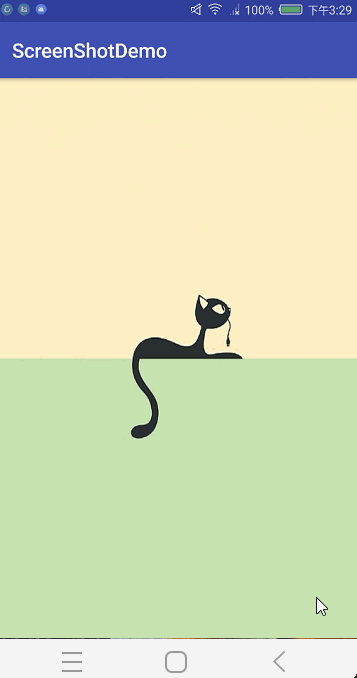

# ScreenShotDemo

Android截屏功能是一个常用的功能，可以方便的用来分享或者发送给好友，本文介绍了如何实现app内截屏监控功能，当发现用户在我们的app内进行了截屏操作时，进行对图片的二次操作，例如添加二维码，公司logo等一系列***。


## 测试截图：


## 截屏原理
Android系统并没有提供截屏通知相关的API，需要我们自己利用系统能提供的相关特性变通实现。Android系统有一个媒体数据库，每拍一张照片，或使用系统截屏截取一张图片，都会把这张图片的详细信息加入到这个媒体数据库，并发出内容改变通知，我们可以利用内容观察者（ContentObserver）监听媒体数据库的变化，当数据库有变化时，获取最后插入的一条图片数据，如果该图片符合特定的规则，则认为被截屏了。

## 判断依据
当ContentObserver监听到媒体数据库的数据改变, 在有数据改变时 获取最后插入数据库的一条图片数据, 如果符合以下规则, 则认为截屏了:

1. 时间判断，图片的生成时间在开始监听之后,并与当前时间相隔10秒内：开始监听后生成的图片才有意义，相隔10秒内说明是刚刚生成的
2. 尺寸判断，图片的尺寸没有超过屏幕的尺寸：图片尺寸超过屏幕尺寸，不可能是截屏图片
3. 路径判断，图片路径符合包含特定的关键词：这一点是关键，截屏图片的保存路径通常包含“screenshot”

这些判断是为了增加截屏检测结果的可靠性，防止误报，防止遗漏。其中截屏图片的路径正常Android系统保存的路径格式， 例如我的是：“外部存储器/storage/emulated/0/Pictures/Screenshots/Screenshot_2017-08-03-15-42-58.png”，但Android系统碎片化严重，加上其他第三方截屏APP等，所以路径关键字除了检查是否包含“screenshot”外，还可以适当增加其他关键字，详见最后的监听器完整代码。这种监听截屏的方法也不是100%准确，例如某些被root的机器使用第三方截屏APP自定义保存路径，还比如通过ADB命令在电脑上获取手机屏幕快照均不能监听到，但这也是目前可行性最高的方法，对于绝大多数用户都比较靠谱。

## 代码描述

### 监听截屏
```java
public class ScreenShotListenManager {
    private static final String TAG = "ScreenShotListenManager";

    /**
     * 读取媒体数据库时需要读取的列
     */
    private static final String[] MEDIA_PROJECTIONS = {
            MediaStore.Images.ImageColumns.DATA,
            MediaStore.Images.ImageColumns.DATE_TAKEN,
    };
    /**
     * 读取媒体数据库时需要读取的列, 其中 WIDTH 和 HEIGHT 字段在 API 16 以后才有
     */
    private static final String[] MEDIA_PROJECTIONS_API_16 = {
            MediaStore.Images.ImageColumns.DATA,
            MediaStore.Images.ImageColumns.DATE_TAKEN,
            MediaStore.Images.ImageColumns.WIDTH,
            MediaStore.Images.ImageColumns.HEIGHT,
    };

    /**
     * 截屏依据中的路径判断关键字
     */
    private static final String[] KEYWORDS = {
            "screenshot", "screen_shot", "screen-shot", "screen shot",
            "screencapture", "screen_capture", "screen-capture", "screen capture",
            "screencap", "screen_cap", "screen-cap", "screen cap"
    };

    private static Point sScreenRealSize;

    /**
     * 已回调过的路径
     */
    private final static List<String> sHasCallbackPaths = new ArrayList<String>();

    private Context mContext;

    private OnScreenShotListener mListener;

    private long mStartListenTime;

    /**
     * 内部存储器内容观察者
     */
    private MediaContentObserver mInternalObserver;

    /**
     * 外部存储器内容观察者
     */
    private MediaContentObserver mExternalObserver;

    /**
     * 运行在 UI 线程的 Handler, 用于运行监听器回调
     */
    private final Handler mUiHandler = new Handler(Looper.getMainLooper());

    private ScreenShotListenManager(Context context) {
        if (context == null) {
            throw new IllegalArgumentException("The context must not be null.");
        }
        mContext = context;

        // 获取屏幕真实的分辨率
        if (sScreenRealSize == null) {
            sScreenRealSize = getRealScreenSize();
            if (sScreenRealSize != null) {
                Log.d(TAG, "Screen Real Size: " + sScreenRealSize.x + " * " + sScreenRealSize.y);
            } else {
                Log.w(TAG, "Get screen real size failed.");
            }
        }
    }

    public static ScreenShotListenManager newInstance(Context context) {
        assertInMainThread();
        return new ScreenShotListenManager(context);
    }

    /**
     * 启动监听
     */
    public void startListen() {
        assertInMainThread();

//        sHasCallbackPaths.clear();

        // 记录开始监听的时间戳
        mStartListenTime = System.currentTimeMillis();

        // 创建内容观察者
        mInternalObserver = new MediaContentObserver(MediaStore.Images.Media.INTERNAL_CONTENT_URI, mUiHandler);
        mExternalObserver = new MediaContentObserver(MediaStore.Images.Media.EXTERNAL_CONTENT_URI, mUiHandler);

        // 注册内容观察者
        mContext.getContentResolver().registerContentObserver(
                MediaStore.Images.Media.INTERNAL_CONTENT_URI,
                false,
                mInternalObserver
        );
        mContext.getContentResolver().registerContentObserver(
                MediaStore.Images.Media.EXTERNAL_CONTENT_URI,
                false,
                mExternalObserver
        );
    }

    /**
     * 停止监听
     */
    public void stopListen() {
        assertInMainThread();

        // 注销内容观察者
        if (mInternalObserver != null) {
            try {
                mContext.getContentResolver().unregisterContentObserver(mInternalObserver);
            } catch (Exception e) {
                e.printStackTrace();
            }
            mInternalObserver = null;
        }
        if (mExternalObserver != null) {
            try {
                mContext.getContentResolver().unregisterContentObserver(mExternalObserver);
            } catch (Exception e) {
                e.printStackTrace();
            }
            mExternalObserver = null;
        }

        // 清空数据
        mStartListenTime = 0;
//        sHasCallbackPaths.clear();

        //切记！！！:必须设置为空 可能mListener 会隐式持有Activity导致释放不掉
        mListener = null;
    }

    /**
     * 处理媒体数据库的内容改变
     */
    private void handleMediaContentChange(Uri contentUri) {
        Cursor cursor = null;
        try {
            // 数据改变时查询数据库中最后加入的一条数据
            cursor = mContext.getContentResolver().query(
                    contentUri,
                    Build.VERSION.SDK_INT < 16 ? MEDIA_PROJECTIONS : MEDIA_PROJECTIONS_API_16,
                    null,
                    null,
                    MediaStore.Images.ImageColumns.DATE_ADDED + " desc limit 1"
            );

            if (cursor == null) {
                Log.e(TAG, "Deviant logic.");
                return;
            }
            if (!cursor.moveToFirst()) {
                Log.d(TAG, "Cursor no data.");
                return;
            }

            // 获取各列的索引
            int dataIndex = cursor.getColumnIndex(MediaStore.Images.ImageColumns.DATA);
            int dateTakenIndex = cursor.getColumnIndex(MediaStore.Images.ImageColumns.DATE_TAKEN);
            int widthIndex = -1;
            int heightIndex = -1;
            if (Build.VERSION.SDK_INT >= 16) {
                widthIndex = cursor.getColumnIndex(MediaStore.Images.ImageColumns.WIDTH);
                heightIndex = cursor.getColumnIndex(MediaStore.Images.ImageColumns.HEIGHT);
            }

            // 获取行数据
            String data = cursor.getString(dataIndex);
            long dateTaken = cursor.getLong(dateTakenIndex);
            int width = 0;
            int height = 0;
            if (widthIndex >= 0 && heightIndex >= 0) {
                width = cursor.getInt(widthIndex);
                height = cursor.getInt(heightIndex);
            } else {
                // API 16 之前, 宽高要手动获取
                Point size = getImageSize(data);
                width = size.x;
                height = size.y;
            }

            // 处理获取到的第一行数据
            handleMediaRowData(data, dateTaken, width, height);

        } catch (Exception e) {
            e.printStackTrace();

        } finally {
            if (cursor != null && !cursor.isClosed()) {
                cursor.close();
            }
        }
    }

    private Point getImageSize(String imagePath) {
        BitmapFactory.Options options = new BitmapFactory.Options();
        options.inJustDecodeBounds = true;
        BitmapFactory.decodeFile(imagePath, options);
        return new Point(options.outWidth, options.outHeight);
    }

    /**
     * 处理获取到的一行数据
     */
    private void handleMediaRowData(String data, long dateTaken, int width, int height) {
        if (checkScreenShot(data, dateTaken, width, height)) {
            Log.d(TAG, "ScreenShot: path = " + data + "; size = " + width + " * " + height
                    + "; date = " + dateTaken);
            if (mListener != null && !checkCallback(data)) {
                mListener.onShot(data);
            }
        } else {
            // 如果在观察区间媒体数据库有数据改变，又不符合截屏规则，则输出到 log 待分析
            Log.w(TAG, "Media content changed, but not screenshot: path = " + data
                    + "; size = " + width + " * " + height + "; date = " + dateTaken);
        }
    }

    /**
     * 判断指定的数据行是否符合截屏条件
     */
    private boolean checkScreenShot(String data, long dateTaken, int width, int height) {
        /*
         * 判断依据一: 时间判断
         */
        // 如果加入数据库的时间在开始监听之前, 或者与当前时间相差大于10秒, 则认为当前没有截屏
        if (dateTaken < mStartListenTime || (System.currentTimeMillis() - dateTaken) > 10 * 1000) {
            return false;
        }

        /*
         * 判断依据二: 尺寸判断
         */
        if (sScreenRealSize != null) {
            // 如果图片尺寸超出屏幕, 则认为当前没有截屏
            if (!((width <= sScreenRealSize.x && height <= sScreenRealSize.y)
                    || (height <= sScreenRealSize.x && width <= sScreenRealSize.y))) {
                return false;
            }
        }

        /*
         * 判断依据三: 路径判断
         */
        if (TextUtils.isEmpty(data)) {
            return false;
        }
        data = data.toLowerCase();
        // 判断图片路径是否含有指定的关键字之一, 如果有, 则认为当前截屏了
        for (String keyWork : KEYWORDS) {
            if (data.contains(keyWork)) {
                return true;
            }
        }

        return false;
    }

    /**
     * 判断是否已回调过, 某些手机ROM截屏一次会发出多次内容改变的通知; <br/>
     * 删除一个图片也会发通知, 同时防止删除图片时误将上一张符合截屏规则的图片当做是当前截屏.
     */
    private boolean checkCallback(String imagePath) {
        if (sHasCallbackPaths.contains(imagePath)) {
            Log.d(TAG, "ScreenShot: imgPath has done"
                    + "; imagePath = " + imagePath);
            return true;
        }
        // 大概缓存15~20条记录便可
        if (sHasCallbackPaths.size() >= 20) {
            for (int i = 0; i < 5; i++) {
                sHasCallbackPaths.remove(0);
            }
        }
        sHasCallbackPaths.add(imagePath);
        return false;
    }

    /**
     * 获取屏幕分辨率
     */
    private Point getRealScreenSize() {
        Point screenSize = null;
        try {
            screenSize = new Point();
            WindowManager windowManager = (WindowManager) mContext.getSystemService(Context.WINDOW_SERVICE);
            Display defaultDisplay = windowManager.getDefaultDisplay();
            if (Build.VERSION.SDK_INT >= Build.VERSION_CODES.JELLY_BEAN_MR1) {
                defaultDisplay.getRealSize(screenSize);
            } else {
                try {
                    Method mGetRawW = Display.class.getMethod("getRawWidth");
                    Method mGetRawH = Display.class.getMethod("getRawHeight");
                    screenSize.set(
                            (Integer) mGetRawW.invoke(defaultDisplay),
                            (Integer) mGetRawH.invoke(defaultDisplay)
                    );
                } catch (Exception e) {
                    screenSize.set(defaultDisplay.getWidth(), defaultDisplay.getHeight());
                    e.printStackTrace();
                }
            }
        } catch (Exception e) {
            e.printStackTrace();
        }
        return screenSize;
    }

    public Bitmap createScreenShotBitmap(Context context, String screenFilePath) {

        View v = LayoutInflater.from(context).inflate(R.layout.share_screenshot_layout, null);
        ImageView iv = (ImageView) v.findViewById(R.id.iv);
        Bitmap bitmap = BitmapFactory.decodeFile(screenFilePath);
        iv.setImageBitmap(bitmap);

        //整体布局
        Point point = getRealScreenSize();
        v.measure(View.MeasureSpec.makeMeasureSpec(point.x, View.MeasureSpec.EXACTLY),
                View.MeasureSpec.makeMeasureSpec(point.y, View.MeasureSpec.EXACTLY));

        v.layout(0, 0, point.x, point.y);

//        Bitmap result = Bitmap.createBitmap(v.getWidth(), v.getHeight(), Bitmap.Config.RGB_565);
        Bitmap result = Bitmap.createBitmap(v.getWidth(), v.getHeight() + dp2px(context, 140), Bitmap.Config.ARGB_8888);
        Canvas c = new Canvas(result);
        c.drawColor(Color.WHITE);
        // Draw view to canvas
        v.draw(c);

        return result;
    }

    private int dp2px(Context ctx, float dp) {
        float scale = ctx.getResources().getDisplayMetrics().density;
        return (int) (dp * scale + 0.5f);
    }

    /**
     * 设置截屏监听器
     */
    public void setListener(OnScreenShotListener listener) {
        mListener = listener;
    }

    public interface OnScreenShotListener {
        void onShot(String imagePath);
    }

    private static void assertInMainThread() {
        if (Looper.myLooper() != Looper.getMainLooper()) {
            StackTraceElement[] elements = Thread.currentThread().getStackTrace();
            String methodMsg = null;
            if (elements != null && elements.length >= 4) {
                methodMsg = elements[3].toString();
            }
            throw new IllegalStateException("Call the method must be in main thread: " + methodMsg);
        }
    }

    /**
     * 媒体内容观察者(观察媒体数据库的改变)
     */
    private class MediaContentObserver extends ContentObserver {

        private Uri mContentUri;

        public MediaContentObserver(Uri contentUri, Handler handler) {
            super(handler);
            mContentUri = contentUri;
        }

        @Override
        public void onChange(boolean selfChange) {
            super.onChange(selfChange);
            handleMediaContentChange(mContentUri);
        }
    }


}

```

### 全局使用
我们需求是要在APP中全局都能监听截屏操作，所以，我们只需要在BaseActivity中进行监听就可以了。
```java
@Override
protected void onResume() {
    super.onResume();
    startScreenShotListen();
}

@Override
protected void onPause() {
    super.onPause();
    stopScreenShotListen();
}

/**
 * 监听
 */
private void startScreenShotListen() {
    if (!isHasScreenShotListener && screenShotListenManager != null) {
        screenShotListenManager.setListener(new ScreenShotListenManager.OnScreenShotListener() {
            @Override
            public void onShot(String imagePath) {

                path = imagePath;
                Log.d("msg", "BaseActivity -> onShot: " + "获得截图路径：" + imagePath);

                MyDialog ksDialog = MyDialog.getInstance()
                        .init(BaseActivity.this, R.layout.dialog_layout)
                        .setCancelButton("取消", null)
                        .setPositiveButton("查看", new MyDialog.OnClickListener() {
                            @Override
                            public void OnClick(View view) {
                                Bitmap screenShotBitmap = screenShotListenManager.createScreenShotBitmap(mContext, path);

                                // 此处只要分享这个合成的Bitmap图片就行了
                                // 为了演示，故写下面代码
                                screenShotIv.setImageBitmap(screenShotBitmap);
                            }
                        });

                screenShotIv = (ImageView) ksDialog.getView(R.id.iv);
                progressBar = (ProgressBar) ksDialog.getView(R.id.avLoad);
                mHandler.postDelayed(new Runnable() {
                    @Override
                    public void run() {
                        progressBar.setVisibility(View.GONE);
                        Glide.with(mContext).load(path).into(screenShotIv);

                    }
                }, 1500);
            }
        });
        screenShotListenManager.startListen();
        isHasScreenShotListener = true;
    }
}

/**
 * 停止监听
 */
private void stopScreenShotListen() {
    if (isHasScreenShotListener && screenShotListenManager != null) {
        screenShotListenManager.stopListen();
        isHasScreenShotListener = false;
    }
}
```

至此APP内监听截屏操作就完成了，我们需要在baseActivity中执行监听并执行相应操作，不需要写更多代码。


